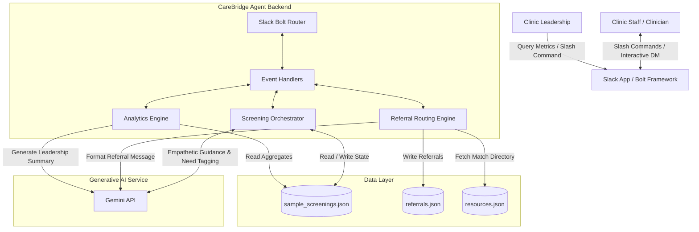

# Technical Architecture: CareBridge AI

CareBridge AI is designed as a modular, event-driven conversational agent operating entirely within the **Slack Workspace**. It integrates Slack's interactive components with Google's Generative AI (Gemini) to guide users, classify needs, and automate workflow routing.

---

## 🏗️ High-Level Component Diagram

---

## 💻 Technology Stack

1. **Host Environment**: Python 3.9+ Runtime.
2. **Slack Integration**: Slack Bolt SDK for Python & Slack Web Client (using Socket Mode or HTTP endpoints).
3. **AI Engine**: `google-genai` SDK linking to Gemini models for processing free-text clinical screening conversations, tagging needs, and clinical summarization.
4. **Data Store**: Structured JSON files serving as a lightweight local database for screenings, referral logs, and local community resource registries.
5. **Validation & Typing**: `pydantic` for schema validation of JSON structures and AI parsing schemas.

---

## 🧩 Core Architectural Components

### 1. Slack Interface & Event Handler
- Receives Slack commands (`/hrs-screen` to start screening, `/hrs-dashboard` to query insights).
- Handles interactive block kit events, buttons, and text submissions.
- Uses **Socket Mode** for local development and direct container communication.

### 2. Conversational Screening Orchestrator
- Maintains progress state for active screenings.
- Prompts clinic staff with empathetic, standardized questions covering each SDoH/HRSN category.
- Feeds responses to Gemini to determine if a specific need is "positive" (identified) or "negative" (none).

### 3. Referral Routing Engine
- Mappings in `config/` associate positive HRSN domains to designated Slack channels (e.g. `housing` -> `#referral-housing`).
- Generates formatted clinician-ready referral briefs using `prompts/referral_prompt.md`.
- Registers outstanding referrals in the mock referral database.

### 4. Leadership & Analytics Engine
- Pulls completed screening history from `data/sample_screenings.json`.
- Compiles counts, metrics (e.g., screening completion rates, most common social needs), and outstanding referral ages.
- Synthesizes findings using Gemini and `prompts/leadership_summary_prompt.md` into natural, executive-friendly status updates in Slack.
