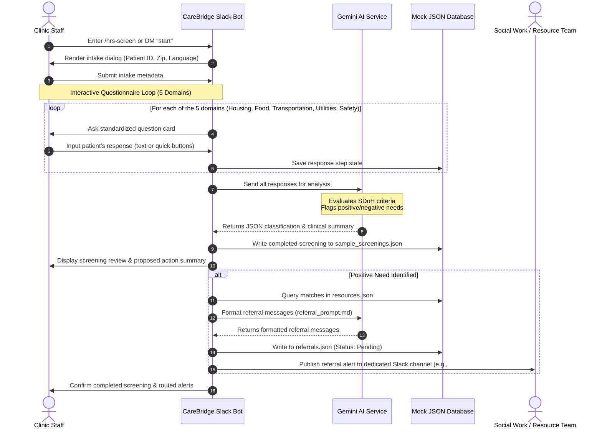

# Workflow & Interaction Flows: CareBridge AI

This document details the conversational and operational workflow of the CareBridge AI screening agent, illustrating how data flows from initial input to referral action and leadership dashboard reporting.

---

## 🏃‍♀️ User Interaction Flow (Sequence)



---

## 📋 Operational Workflow Details

### 1. Screening Trigger
A clinic staff member initiates a new screening by:
- Typing `/hrs-screen` in any Slack channel.
- Sending a direct message like "New screening" or "screening" to the CareBridge bot.
- Using a Slack shortcut.

### 2. Intake Metadata collection
Before asking clinical questions, the bot opens a Slack modal or interactive message requesting basic context:
- **Patient Identifier**: Unique anonymized code (e.g., `PAT-4929`) to preserve HIPAA privacy while tracking needs.
- **Zip Code**: Used to match proximity-based resources.
- **Primary Language**: Helps select resource materials.

### 3. Question Sequence
The agent goes through 5 consecutive check-in sections:
1. **Housing**: "In the past 12 months, have you had trouble paying rent or been worried about losing your housing?"
2. **Food**: "In the past 12 months, did you ever run out of food and not have money to buy more?"
3. **Transportation**: "In the past 12 months, has lack of transportation kept you from medical appointments, meetings, or work?"
4. **Utilities**: "In the past 12 months, has the utility company threatened to shut off your services?"
5. **Safety**: "Are you currently worried about your physical safety at home or in your neighborhood?"

### 4. Classification & Summary
Once all answers are collected:
- The text is summarized to create a standardized patient screening note.
- Needs are flagged with structured boolean tags:
  ```json
  {
    "housing_insecurity": true,
    "food_insecurity": false,
    "transportation_barrier": true,
    "utility_instability": false,
    "safety_concern": false
  }
  ```
- If a positive need is detected, the agent queries `resources.json` to extract corresponding local services (e.g., local food pantries, emergency rent relief programs).

### 5. Automated Routing
The routing module detects positive needs and dispatches notices:
- **Housing Referral**: Posted to `#referral-housing` with patient ID, zip code, and matching housing programs.
- **Food Insecurity Referral**: Posted to `#referral-food` detailing food program listings.
- Each routed referral is saved to `referrals.json` with a status of `Pending`.

---

## 📊 Administration Reporting Flow

Administrators check operational efficiency metrics by typing `/hrs-dashboard` inside the admin channel:
1. The **Analytics Engine** parses `sample_screenings.json` and `referrals.json`.
2. It compiles metrics:
   - Total screenings completed.
   - Percentage of positive screens by domain.
   - Referral resolution rates (Pending vs. Resolved).
3. The raw statistics are passed to Gemini via `leadership_summary_prompt.md` to produce a high-level briefing that points out resource bottlenecks (e.g., "Housing referrals have increased by 20% this month; local emergency shelters are reporting capacity issues").
4. The dashboard is rendered in Slack.
